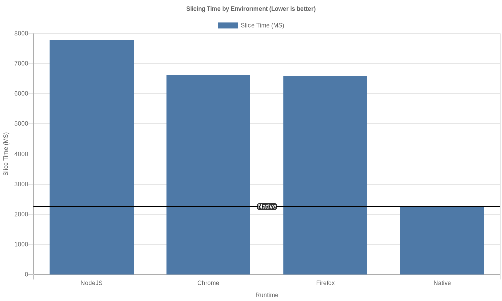

# Cura WASM
[](https://npmjs.com/package/cura-wasm)
[](https://github.com/Cloud-CNC/cura-wasm/actions)
[](https://codeclimate.com/github/Cloud-CNC/cura-wasm/maintainability)
[](https://github.com/Cloud-CNC/cura-wasm/commits/master)
[](https://app.fossa.com/projects/git%2Bgithub.com%2FCloud-CNC%2Fcura-wasm?ref=badge_shield)

[Cura Engine](https://github.com/ultimaker/curaengine) powered by [Web Assembly (WASM)](https://webassembly.org)

## Features
* Written in modern TypeScript
* Uses Rollup for JS/TS compilation
* Uses Docker for C++ compilation (Enhanced reproducibility)
* Ships with **everything** already compiled
* Works in the browser and on NodeJS
* Thoroughly commented

## Usage

### Exports
Cura WASM ships with both ES6 and CJS exports. The ES6 version is built with browsers in mind and likely won't work on NodeJS; the CJS version is built with NodeJS in mind and almost certainly won't work on browsers due to lacking standard modules.

### Examples
* Basic Benchy + Ultimaker 2 example
```Javascript
import CuraWASM from 'cura-wasm';

const main = async () =>
{
  //Create a new slicer
  const slicer = new CuraWASM({
    /*
     * The 3D printer definition to slice for (See the src/definitions directory
     * or https://github.com/Ultimaker/Cura/tree/master/resources/definitions
     * for a list of built-in definitions)
     */
    definition: 'ultimaker2',

    /*
     * Overrides for the current 3D printer definition (Passed to Cura Engine
     * with the -s CLI argument)
     */
    overrides: [
      {
        /*
         * The scope of the setting. (Passed to Cura Engine with a leading
         * hyphen before the corresponding -s argument)
         */
        scope: 'e0',

        //The override's key/name
        key: 'mesh_position_x',

        //The override's value
        value: -10
      }
    ],

    /**
     * Wether or not to transfer the input STL ArrayBuffer to the worker thread
     * (Prevents duplicating large amounts of memory but empties the ArrayBuffer
     * on the main thread preventing other code from using the ArrayBuffer)
     */
    transfer: true,

    /*
     * Wether to enable verbose logging (Useful for debugging; allows Cura
     * Engine to directly log to the console)
     */
    verbose: true
  });

  //Load your STL as an ArrayBuffer
  const res = await fetch('/demo/benchy.stl');
  const stl = await res.arrayBuffer();

  //Progress logger (Ranges from 0 to 100)
  slicer.on('progress', percent =>
  {
    console.log(`Progress: ${percent}%`);
  });

  //Slice (This can take multiple minutes to resolve!)
  const gcode = await slicer.slice(stl);

  //Do something with the GCODE (ArrayBuffer)

  //Dispose (Reccomended but not necessary to call/intended for SPAs)
  slicer.dispose();
}
main();
```

* Multiple browser examples can be found in the [`demo`](demo) and [`tests/web` directory](tests/web) (Which is used for browser tests).
* Multiple NodeJS examples can be found in the [`tests/node` directory](tests/node).

### Performance
The performance is decent but not great. If you're running NodeJS, consider using Native Cura Engine instead unless you want the isolation from the WASM VM.

*Note: Cura Engine uses OpenMP for multithreading, however, Emscripten doesn't support OpenMP.*

Name | Slice Time
--- | ---
`NodeJS V14.4.0` | `6084ms`
`Chrome 83.0.4103.116` | `5476ms`
`Firefox 77.0.1` | `5035ms`
`Native Cura Engine V4.6.1` | `1945ms`

[](assets/chart.png)

*Note: NodeJS, Chrome, and Firefox were ran 3 times then averaged; Native Cura Engine was ran 6 times then averaged due to more inconsistent times. The benchmarking computer ran Windows 10 Pro 2004 (19041.329) and had a Ryzen 7 3700X, 32GB DDR4-3600MHZ (CL16), NVMe Gen 4 SSD, and an RTX 2070 Super (Maybe the GPU matters* ¯\\_(ツ)_/¯ *).*

### Low level API
If you want more finite control over Cura WASM, consider interacting with the worker ([`worker.ts`](src/worker.ts)) and bypassing the normal `CuraWASM` ([`index.ts`](src/index.ts)) class. This allows finite control over the command line arguments passed to Cura Engine, direct file I/O, and more; you'll need to re-implement some of the worker management found in the CuraWASM class though. If that's not low enough, consider directly importing [`CuraEngine.js`](src/CuraEngine.js) (Which is directly built by Emscripten); be warned: it will choke up the calling thread hence the need for Threads JS.

## FAQ

### How does it work?
Cura WASM uses [emscripten](https://emscripten.org) to compile [Cura Engine](https://github.com/ultimaker/curaengine) to [Web Assembly](https://webassembly.org).

Emscripten provides a virtual filesystem with which Cura WASM loads your STL into as well as the 3D printer definitions. Cura WASM includes a very small modification to Cura Engine which makes it call 2 global functions (Unique to each instance of Cura WASM) alerting Cura WASM when the progress updates and when the part is done so Cura WASM can read the GCODE out of the virtual filesystem.

### Hasn't this been done before?
Yes, this is by no means the first time someone has compiled Cura Engine to run in the browser. Previous projects include [gyf304/cura-emscripten](https://github.com/gyf304/cura-emscripten), [nelsonsilva/CuraEngine-em](https://github.com/nelsonsilva/CuraEngine-em), [Skeen/CuraJS-Engine](https://github.com/Skeen/CuraJS-Engine), and possibly more. However, none of these are maintained and only one (CuraJS) is meant to be used as a library - not a stand-alone application.

### Can I contribute?
Yes. If you're looking for something specific to help with, I'd greatly appreciate any help with making Cura Engine run faster, tightening the JS/TS <---> C++ coupling (eg: improved Cura Engine error reporting), and improving the JS/TS API (eg: allow users to only bundle the printer definitions they need).

### Why is this licensed under AGPL3+?
Because this ships with Cura Engine already compiled [which itself uses AGPL3+](https://github.com/Ultimaker/CuraEngine/blob/master/LICENSE). So instead of separately licensing the new code under something like MIT (Which the rest of [Cloud CNC](https://github.com/cloud-cnc) uses), it's just simpler to use AGLP3+ for all of Cura WASM. If this is a problem, and you'd like to see everything except the compiled Cura Engine licensed under something like MIT, feel free to file an issue.

[](https://app.fossa.com/projects/git%2Bgithub.com%2FCloud-CNC%2Fcura-wasm?ref=badge_large)